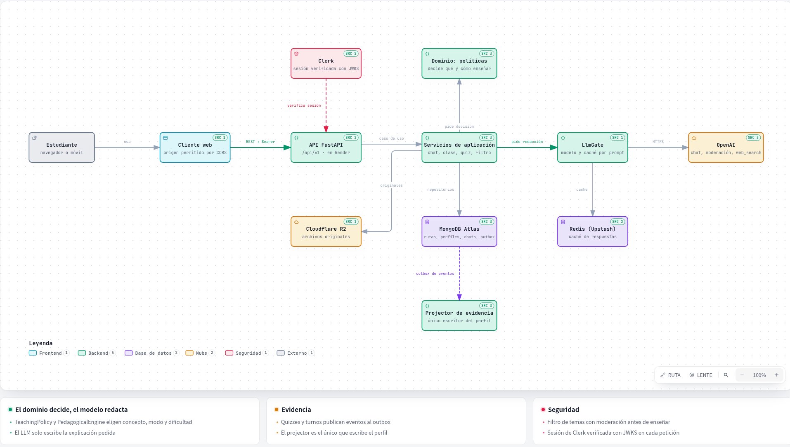
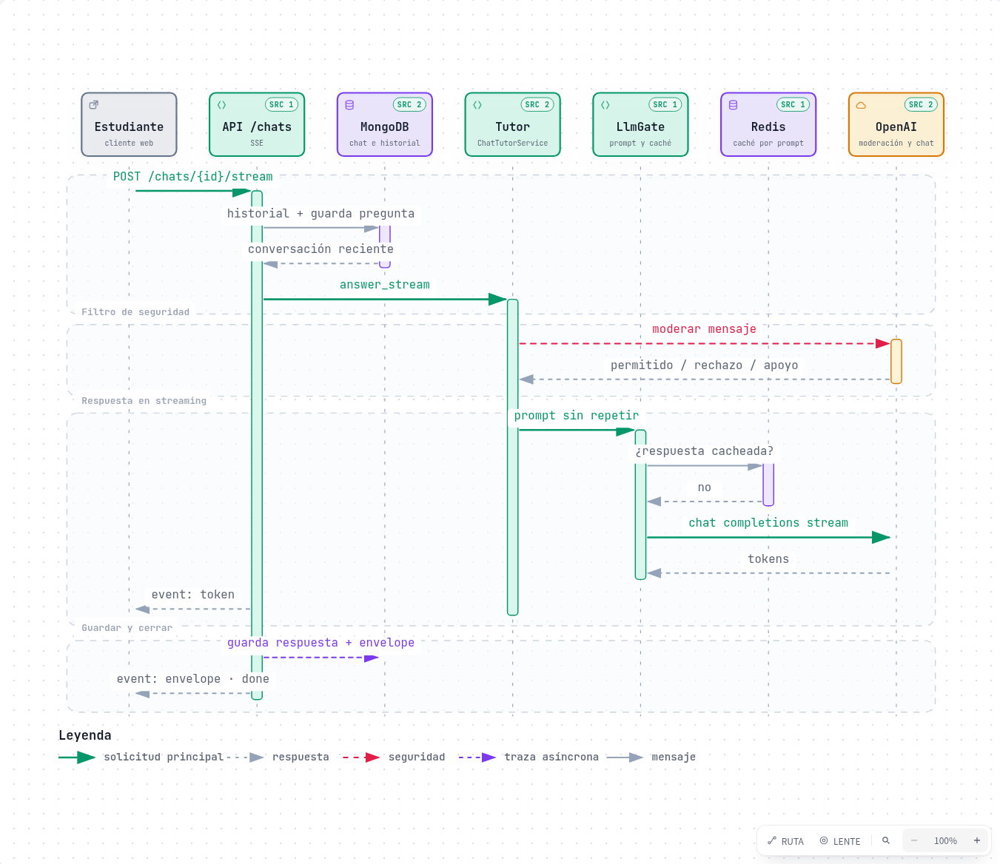
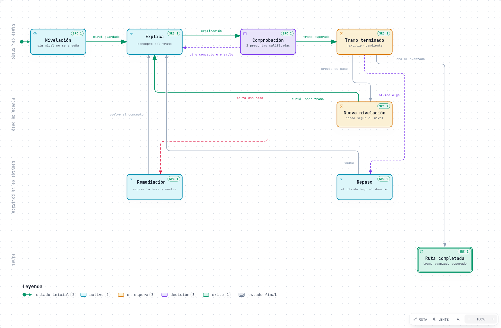

# Plenum

Plenum es una plataforma de aprendizaje. **LARIA** es su tutor inteligente adaptativo: una API que usa la evidencia de aprendizaje (perfil cognitivo, quizzes, interacciones) para decidir *cómo* enseñar, y un modelo de lenguaje solo para *decir* esa decisión. El objetivo no es responder preguntas, sino que el estudiante aprenda.

No es un chatbot con historial: responder bien no se toma como prueba de comprensión.

## Arquitectura



> Versión interactiva, con las fuentes de cada nodo en el código: [`docs/diagramas/laria-arquitectura.html`](docs/diagramas/laria-arquitectura.html). Descárgala y ábrela en el navegador.

- **El dominio decide; el modelo redacta.** `TeachingPolicy`, `PedagogicalEngine` y `TutorPolicy` eligen qué concepto, qué modo y qué dificultad. El LLM solo escribe lo que se le pide.
- **Hexagonal.** Los routers FastAPI llaman a servicios de aplicación. El dominio no lee configuración ni hace I/O. Los adaptadores (MongoDB Atlas, Redis/Upstash, Cloudflare R2, OpenAI, Clerk) están detrás de puertos.
- **El perfil tiene un solo escritor.** Quizzes y turnos publican eventos en un outbox de Mongo, y el *projector* de evidencia es el único que escribe el perfil.
- **Despliegue:** la API corre en Render (rama `feature/backend`) y el cliente web en Vercel.

## Un turno del chat



> Interactivo: [`docs/diagramas/laria-turno-chat.html`](docs/diagramas/laria-turno-chat.html)

1. **Memoria.** La API recupera la conversación reciente y guarda la pregunta antes de responder.
2. **Filtro de seguridad** (ADR-036). El mensaje pasa por la moderación de OpenAI antes que nada.
   - Un tema que podría hacer daño se rechaza con un mensaje fijo.
   - Una señal de autolesión recibe siempre una respuesta de apoyo.
   - En ninguno de los dos casos se llama al modelo ni queda evidencia.
3. **Redacción.** `LlmGate` arma el prompt, incluida la regla de no repetirse (ADR-040). Consulta la caché de Redis y, si no hay respuesta guardada, pide a OpenAI la respuesta en streaming.
4. **Cierre.** El cliente recibe los tokens por SSE. Al terminar, la respuesta y su *envelope* (tipo, emoción, payload) quedan guardados en el chat.

## La clase por tramos



> Interactivo: [`docs/diagramas/laria-clase-tramos.html`](docs/diagramas/laria-clase-tramos.html)

- **Nivelación primero.** Sin nivel guardado no se enseña: la nivelación del tema dice por dónde empezar (ADR-031).
- **Explicación y comprobación.** Cada concepto lleva una explicación y una comprobación de 2 preguntas calificadas en el servidor. La política decide qué viene después:
  - el siguiente concepto;
  - otro ejemplo;
  - una reformulación;
  - remediar una base, solo con evidencia de que falta (ADR-028).
- **Tramos.** La ruta tiene tramos `básico → intermedio → avanzado`, de 5 a 8 módulos cada uno (ADR-037).
  - Al terminar un tramo, la **prueba de paso** es la nivelación del mismo tema.
  - Si sube de nivel, la ruta añade el temario del tramo nuevo, sin repetir lo visto, y la clase continúa.
- **Temario investigado.** Los tramos intermedio y avanzado se investigan en internet: el temario de cada módulo lleva ideas clave y fuentes reales, verificadas a partir de las citas de la búsqueda (ADR-039).
- **Repaso.** Si el olvido baja un concepto ya superado, la ruta se reabre para repasarlo (ADR-032).

## Qué hay hoy

| Capacidad | Estado |
|-----------|--------|
| Cuentas propias, Google y Clerk; recurso ajeno → 404 | En producción |
| Documentos (PDF, Word, Excel, PowerPoint, texto, código), análisis por secciones y quizzes sobre el material | En producción |
| Chat con o sin documento, streaming, memoria de la conversación y voz (6 voces) | En producción |
| Nivelación calibrada por rondas y práctica por tema | En producción |
| Clase guiada con rutas por tramos y temario investigado con fuentes | En producción |
| Repaso espaciado, metas y tiempo de estudio, sugerencias de qué seguir | En producción |
| Filtro de temas y mensajes; apoyo ante señales de autolesión | En producción |
| Tutorial de bienvenida guardado en la cuenta | En producción |
| Borrado de la cuenta y de todos sus datos, también en Clerk (ADR-041) | En la rama, pendiente de desplegar |

**Límites honestos:**
- **Sin RAG ni embeddings:** el contexto sale del documento del estudiante, analizado por secciones.
- **Sin LMS ni organizaciones.**
- **Solo español:** el tutor está escrito y probado en español. El plan para responder en el idioma del estudiante está pendiente.
- **Embodiment desactivado por defecto:** la presencia física y los sensores siguen detrás de puertos. La voz del tutor sí funciona.

Detalle de capas, agregados y contratos: [`backend/docs/architecture.md`](backend/docs/architecture.md), [`backend/docs/endpoints.md`](backend/docs/endpoints.md) y las decisiones en [`backend/docs/adr/`](backend/docs/adr/).

## Arranque local

Stack: **Python 3.13**, FastAPI, MongoDB (opcional: `DB_PROVIDER=memory` basta para desarrollo y tests) y OpenAI.

```bash
cd backend
cp .env.example .env    # completar las variables que pide el ejemplo
pip install -r requirements.txt
uvicorn src.main:app --reload --port 8000
```

API en `http://localhost:8000`. Health: `/health`. Swagger solo si la configuración de docs está habilitada.

Con Docker, desde `backend/`:

```bash
docker compose up --build -d
```

Tests (desde `backend/`, sin Mongo real ni red: la moderación y la búsqueda web están apagadas en la suite):

```bash
pip install -r requirements-dev.txt
python -m pytest tests -q
```

Guía completa: [`backend/README.md`](backend/README.md).

## Regenerar los diagramas

Los diagramas se generan con [archify](https://github.com/tt-a1i/archify) a partir del JSON junto a cada uno (`docs/diagramas/*.json`). Cada nodo cita el archivo y las líneas del código en que se basa, fijados en un commit.

```bash
npx skills add tt-a1i/archify -g      # una vez
node ~/.claude/skills/archify/bin/archify.mjs finalize architecture \
  docs/diagramas/laria-arquitectura.json docs/diagramas/laria-arquitectura.html \
  --repo-root . --quality showcase --json
```

Si el código cambia, actualiza `meta.repository.revision` y las líneas de `sources` antes de regenerar. La comprobación en navegador necesita Chrome o Chromium (`ARCHIFY_CHROME`).

## Documentación

| Recurso | Contenido |
|---------|-----------|
| [`backend/README.md`](backend/README.md) | Stack, arranque, tests y seguridad del API |
| [`backend/docs/`](backend/docs/) | Arquitectura, endpoints, contratos, Mongo, ADRs y despliegue |
| [`docs/diagramas/`](docs/diagramas/) | Diagramas interactivos y su JSON fuente |
| [`CICD.md`](CICD.md) | Flujo de ramas, PRs y verificación (equipo + agentes) |

## Ramas

```
feature/backend   → develop
feature/frontend  → develop
develop           → main
```

`develop` integra y `main` recibe las releases. `feature/backend` se despliega sola en Render. Convención y comandos: [`CICD.md`](CICD.md).
