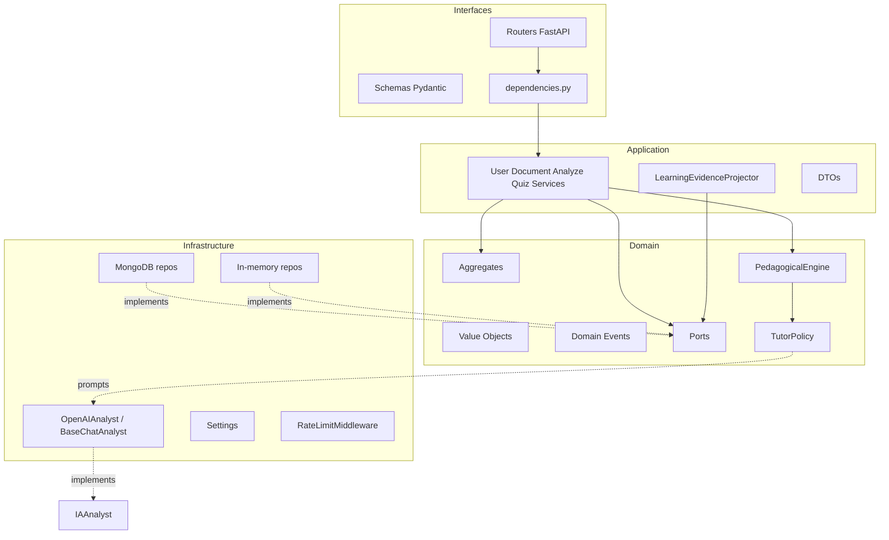
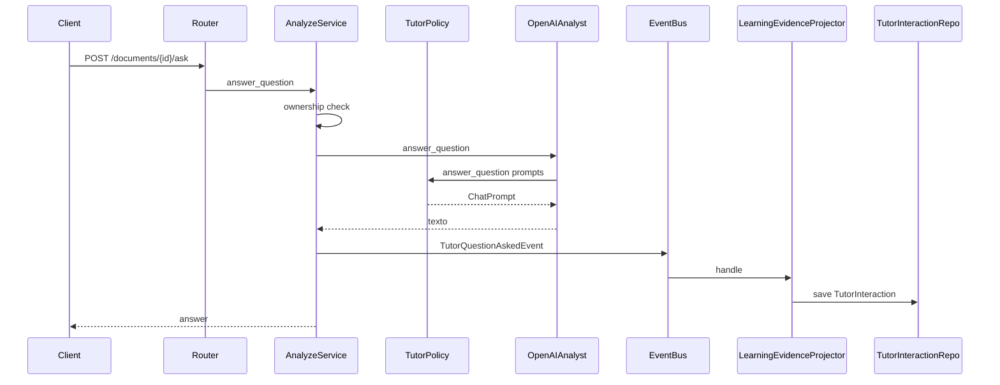

# Arquitectura del sistema (Backend LARIA)

## Principios

1. **LARIA es un tutor**, no un chatbot: el objetivo es que el estudiante aprenda.
2. **El modelo de IA solo genera lenguaje.** La inteligencia educativa está en dominio/aplicación (`TutorPolicy`, evidencia, ownership, grading).
3. **DDD + Clean Architecture + SOLID**: el dominio no depende de FastAPI, Mongo ni OpenAI.
4. **Inversión de dependencias**: puertos en `domain/ports`; adaptadores en `infrastructure/`.

## Capas

| Capa | Responsabilidad | No debe |
|------|-----------------|--------|
| `interfaces` | HTTP, validación de entrada, mapeo a DTO/schema | Contener reglas de grading/ownership de negocio |
| `application` | Orquestar casos de uso, publicar/suscribir evidencia | Conocer detalles HTTP o SQL/BSON |
| `domain` | Invariantes, agregados, eventos, política de prompts | Importar FastAPI/Motor/httpx |
| `infrastructure` | I/O real (DB, OpenAI, rate limit, config) | Definir reglas pedagógicas “de negocio” más allá del transporte |

## Aggregates principales

| Aggregate | Rol |
|-----------|-----|
| `UserAggregate` | Identidad, roles (`student`/`admin`), password hashing |
| `DocumentAggregate` | Material del estudiante, estado de análisis, ownership |
| `QuizAggregate` | Preguntas MCQ, grading server-side |
| `QuizAttemptAggregate` | Intento calificado + evento `QuizAttemptCompletedEvent` |
| `TutorInteractionAggregate` | Evidencia Q&A tutor |

El análisis vive **en el documento** (`analysis_result`), no en un bounded context Analysis separado (eliminado por deuda).

## Puertos relevantes

- `UserRepository`, `DocumentRepository`, `QuizRepository`, `QuizAttemptRepository`, `TutorInteractionRepository`
- `IAAnalyst`: `analyze`, `answer_question`, `generate_quiz`
- `EventBus`: publish/subscribe de eventos de dominio

## Flujo típico: preguntar al tutor

## Seguridad (corte transversal)

- Arranque fail-closed: `SECRET_KEY` segura + `OPENAI_API_KEY` + solo `IA_PROVIDER=openai`.
- JWT algoritmo **HS256 fijado en código** (`JWT_ALGORITHM`), no configurable por env.
- Rate limiting por IP en auth y rutas de documentos/quizzes.
- Mensajes de registro sin enumeración de email/username.
- Login con bcrypt dummy si el usuario no existe (mitiga timing).
- Docs/OpenAPI detrás de `ENABLE_DOCS`.
- FastAPI `debug=False` siempre (sin stack traces al cliente).
- Mongo en Compose: autenticado, **sin** publicar `27017` al host.
- Contenedor app corre como usuario no-root.

## Persistencia dual

`DB_PROVIDER=memory` (default local/tests) o `mongodb` (Compose/prod). Los puertos son los mismos; DI en `dependencies.py` elige el adaptador.

## Logging operativo

- `configure_logging()` en arranque (`LOG_LEVEL`, `LOG_FORMAT=text|json`).
- `RequestLoggingMiddleware`: método, path, status, `X-Request-Id`, duración (sin bodies ni tokens).
- Loggers: `laria.http`, `laria.pedagogy`, `laria.llm`, `laria.learning`.
- Distinto de `/metrics` (contadores); los logs son traza operativa.

## Evidencia y perfil cognitivo (estado actual)

`LearningEvidenceProjector` suscribe:

- `QuizAttemptCompletedEvent` → mastery multi-señal por concepto + interacción
- `TutorQuestionAskedEvent` → struggle/ayuda/latencia + memoria pedagógica

`StudentProfile` mantiene `ConceptMastery` con `effective_mastery` (curva del olvido), confianza y `PedagogicalMemory`.

`PedagogicalEngine` decide modo, dificultad dinámica, estilo cognitivo y gate de prerrequisitos **antes** de llamar al LLM (`TutorPolicy` solo compone prompts).

APIs:

- `GET /api/v1/learning/me` — historial + recomendaciones (`RecommendationEngine`)
- `GET /api/v1/learning/me/profile` — mastery efectivo, confianza, memoria
- `GET /metrics` — métricas del sistema (tokens, cache, conceptos)

## Modelo OpenAI y economía

- Default: `OPENAI_MODEL_DEFAULT` / `OPENAI_MODEL` = `gpt-4o-mini`
- Fuerte: `OPENAI_MODEL_STRONG` vía `ModelRouter` (struggle alto, socrático+hard)
- `LlmGate` + `CachePort`: reutiliza análisis/quizzes/respuestas equivalentes; invalida por hash de contenido y versión de política
- Ver ADR-001 y ADR-003
