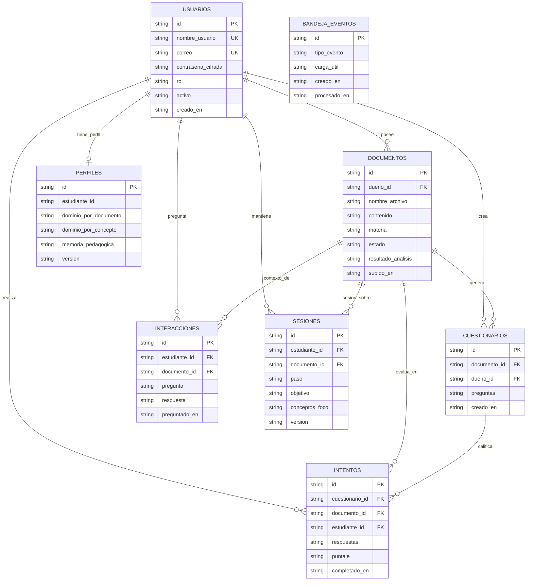
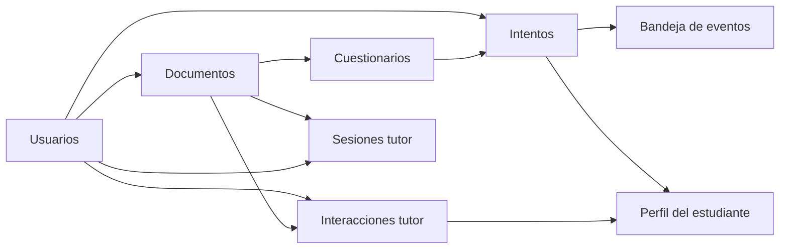

# Esquema MongoDB — LARIA Backend

Base de datos: `laria_db` (configurable con `MONGODB_DB_NAME`).  
Cliente: Motor (async). IDs de dominio: UUID en string. No hay joins nativos; las relaciones son por referencia lógica.

Fuente de verdad: repositorios en `src/infrastructure/mongodb/` e índices en `indexes.py` (rama `feature/backend`).

## Diagrama de relaciones

Etiquetas en español. Los nombres reales de colección en Mongo están en la leyenda debajo / en las secciones de colecciones.

Nombres reales en Mongo: `users`, `documents`, `quizzes`, `quiz_attempts`, `tutor_interactions`, `tutor_sessions`, `student_profiles`, `event_outbox`, más GridFS `fs.files` / `fs.chunks` para el cuerpo del material. El análisis va embebido en `documents.analysis_result`.

## Colecciones

### `users`

| Campo | Tipo | Notas |
|-------|------|--------|
| `_id` | string (UUID) | PK |
| `username` | string | índice único |
| `email` | string | índice único |
| `hashed_password` | string | bcrypt |
| `role` | `"student"` \| `"admin"` | legado `"teacher"` → student |
| `is_active` | bool | |
| `created_at` | datetime | |

### `documents`

| Campo | Tipo | Notas |
|-------|------|--------|
| `_id` | string (UUID) | PK |
| `owner_id` | string (UUID) | → `users._id`; índice |
| `filename` | string | |
| `content` | string | vacío si hay blob; legacy inline; omitido en listados |
| `content_blob_id` | string \| null | ObjectId hex de GridFS (`fs.files`) |
| `subject` | string | p. ej. materia |
| `status` | `uploaded` \| `analyzing` \| `analyzed` \| `error` | |
| `uploaded_at` | datetime | |
| `analysis_result` | object \| ausente | embebido (no colección aparte) |
| `error_message` | string \| null | |

### GridFS (`fs.files` / `fs.chunks`)

Cuerpo del material (hasta `DOCUMENT_MAX_UPLOAD_BYTES`, 200 MiB por defecto). Evita el límite BSON de 16 MB en `documents`.

**`analysis_result` embebido:**

| Campo | Tipo |
|-------|------|
| `summary` | string |
| `key_concepts` | string[] |
| `suggested_questions` | string[] |
| `confidence_score` | float |

> El bounded context `AnalysisRepository` / colección `analyses` fue eliminado (ADR-001). Puede quedar bytecode legado en árboles locales; no forma parte del modelo actual.

### `quizzes`

| Campo | Tipo | Notas |
|-------|------|--------|
| `_id` | string (UUID) | PK |
| `document_id` | string | → `documents._id`; índice |
| `owner_id` | string | → `users._id`; índice |
| `questions` | array | ver abajo |
| `created_at` | datetime | |

**Elemento de `questions`:**

| Campo | Tipo |
|-------|------|
| `text` | string |
| `options` | object `{ "A": "...", "B": "..." }` |
| `correct_answer` | string |
| `difficulty` | `easy` \| `medium` \| `hard` |
| `concept_tags` | string[] |

### `quiz_attempts`

| Campo | Tipo | Notas |
|-------|------|--------|
| `_id` | string (UUID) | PK |
| `quiz_id` | string | → `quizzes._id` |
| `document_id` | string | → `documents._id`; índice |
| `student_id` | string | → `users._id`; índice |
| `answers` | object | claves índice pregunta → opción |
| `per_question_correct` | bool[] | |
| `score` | int | |
| `total_points` | int | |
| `completed_at` | datetime | |

### `tutor_interactions` (persistencia de conversación Q&A)

| Campo | Tipo | Notas |
|-------|------|--------|
| `_id` | string (UUID) | PK |
| `student_id` | string | índice |
| `document_id` | string | índice |
| `question` | string | |
| `answer` | string | |
| `asked_at` | datetime | |

Cada `POST /documents/{id}/ask` genera evidencia vía eventos y se proyecta aquí.

### `tutor_sessions` (estado multi-turno del tutor)

| Campo | Tipo | Notas |
|-------|------|--------|
| `_id` | string | `{student_id}:{document_id}` (único compuesto) |
| `id` | string (UUID) | id de dominio |
| `student_id` | string | |
| `document_id` | string | índice |
| `step` | string | p. ej. `introduce` |
| `objective` | string | |
| `focus_concepts` | string[] | |
| `hints_given` | string[] | |
| `turns` | int | |
| `updated_at` | datetime | |
| `version` | int | concurrency optimista |

### `student_profiles` (perfil cognitivo / memoria educativa)

| Campo | Tipo | Notas |
|-------|------|--------|
| `_id` | string | = `student_id` |
| `student_id` | string | |
| `mastery_by_document` | map | clave = document_id |
| `mastery_by_concept` | map | clave = concept_key |
| `frequent_errors` | string[] | |
| `pace` | string | default `steady` |
| `total_attempts` | int | |
| `total_struggle_signals` | int | |
| `learning_velocity` | float | |
| `pedagogical_memory` | object | ver abajo |
| `updated_at` | datetime | |
| `version` | int | concurrency optimista |

**`mastery_by_document[docId]`:** `document_id`, `attempts`, `mastery`, `last_score_ratio`, `incorrect_streak`, `struggle_signals`.

**`mastery_by_concept[key]`:** `concept_key`, `attempts`, `mastery`, `last_score_ratio`, `document_ids[]`, `confidence`, `last_practiced_at`, `help_requests`, `latency_ms_ema`, `error_streak`, `subject`, `evidence_count`, `half_life_days`.

**`pedagogical_memory`:** `frequent_misconceptions[]`, `successful_examples[]`, `successful_analogies[]`, `preferred_explanation_style`, `last_effective_strategies[]`.

### `event_outbox` (bus async)

| Campo | Tipo | Notas |
|-------|------|--------|
| `_id` | string (UUID) | PK |
| `event_type` | string | p. ej. `QuizAttemptCompletedEvent` |
| `payload` | object | evento serializado |
| `created_at` | datetime | |
| `processed_at` | datetime \| null | índice |
| `attempts` | int | reintentos |
| `last_error` | string \| null | |

Activo cuando `EVENT_BUS_BACKEND=outbox`.

## Índices (arranque)

Definidos en `ensure_all_indexes()`:

| Colección | Índice |
|-----------|--------|
| `users` | `email` unique, `username` unique |
| `documents` | `owner_id` |
| `quizzes` | `document_id`, `owner_id` |
| `quiz_attempts` | `student_id`, `document_id` |
| `tutor_interactions` | `student_id`, `document_id` |
| `tutor_sessions` | `document_id`, unique `(student_id, document_id)` |
| `event_outbox` | `processed_at`, `(processed_at, created_at)` |

## Flujo de datos (cómo se conectan)

1. El estudiante (colección `users`) sube material → `documents`.
2. El análisis de OpenAI se guarda **dentro** del documento.
3. Cuestionario → `quizzes`; intento → `quiz_attempts` + evento en bandeja/memoria.
4. Pregunta al tutor → `tutor_interactions` + actualización de `tutor_sessions`.
5. El proyector de evidencia actualiza `student_profiles` (dominio + memoria pedagógica).

## Dualidad memory / mongodb

Con `DB_PROVIDER=memory` las mismas formas de documento viven en repositorios in-memory (tests/dev). El contrato de campos es idéntico al de Mongo.
