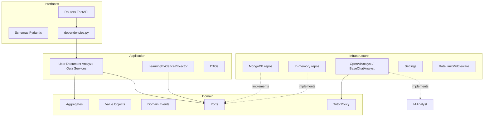
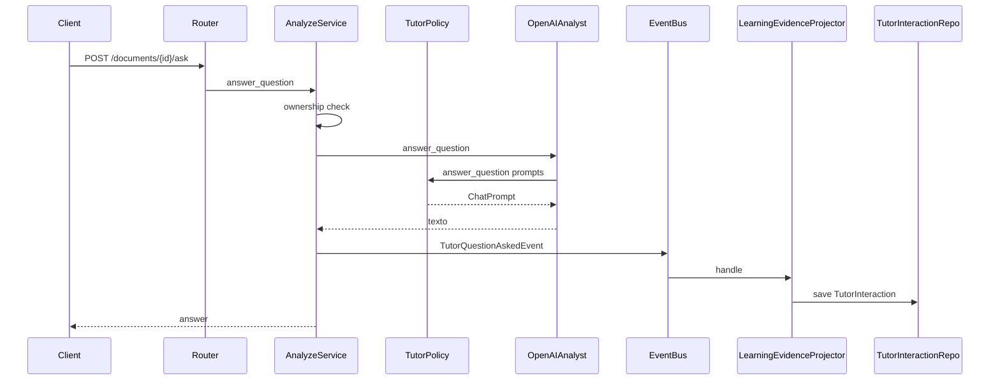

# Arquitectura del sistema (Backend LARIA)

## Principios

1. **LARIA es un tutor**, no un chatbot: el objetivo es que el estudiante aprenda.
2. **El modelo de IA solo genera lenguaje.** La inteligencia educativa está en dominio/aplicación (`TutorPolicy`, evidencia, ownership, grading).
3. **DDD + Clean Architecture + SOLID**: el dominio no depende de FastAPI, Mongo ni OpenAI.
4. **Inversión de dependencias**: puertos en `domain/ports`; adaptadores en `infrastructure/`.

## Capas

| Capa | Responsabilidad | No debe |
|------|-----------------|--------|
| `interfaces` | HTTP, validación de entrada, mapeo a DTO/schema | Contener reglas de grading/ownership de negocio |
| `application` | Orquestar casos de uso, publicar/suscribir evidencia | Conocer detalles HTTP o SQL/BSON |
| `domain` | Invariantes, agregados, eventos, política de prompts | Importar FastAPI/Motor/httpx |
| `infrastructure` | I/O real (DB, OpenAI, rate limit, config) | Definir reglas pedagógicas “de negocio” más allá del transporte |

## Aggregates principales

| Aggregate | Rol |
|-----------|-----|
| `UserAggregate` | Identidad, roles (`student`/`teacher`/`admin`), password hashing |
| `DocumentAggregate` | Material del estudiante, estado de análisis, ownership |
| `QuizAggregate` | Preguntas MCQ, grading server-side |
| `QuizAttemptAggregate` | Intento calificado + evento `QuizAttemptCompletedEvent` |
| `TutorInteractionAggregate` | Evidencia Q&A tutor |

El análisis vive **en el documento** (`analysis_result`), no en un bounded context Analysis separado (eliminado por deuda).

## Puertos relevantes

- `UserRepository`, `DocumentRepository`, `QuizRepository`, `QuizAttemptRepository`, `TutorInteractionRepository`
- `IAAnalyst`: `analyze`, `answer_question`, `generate_quiz`
- `EventBus`: publish/subscribe de eventos de dominio

## Flujo típico: preguntar al tutor

## Seguridad (corte transversal)

- Arranque fail-closed: `SECRET_KEY` segura + `OPENAI_API_KEY` + solo `IA_PROVIDER=openai`.
- JWT algoritmo **HS256 fijado en código** (`JWT_ALGORITHM`), no configurable por env.
- Rate limiting por IP en auth y rutas de documentos/quizzes.
- Mensajes de registro sin enumeración de email/username.
- Login con bcrypt dummy si el usuario no existe (mitiga timing).
- Docs/OpenAPI detrás de `ENABLE_DOCS`.
- FastAPI `debug=False` siempre (sin stack traces al cliente).
- Mongo en Compose: autenticado, **sin** publicar `27017` al host.
- Contenedor app corre como usuario no-root.

## Persistencia dual

`DB_PROVIDER=memory` (default local/tests) o `mongodb` (Compose/prod). Los puertos son los mismos; DI en `dependencies.py` elige el adaptador.

## Evidencia de aprendizaje (estado actual)

`LearningEvidenceProjector` suscribe:

- `TutorQuestionAskedEvent` → interacción tutor
- `QuizAttemptCompletedEvent` → nota de evidencia en el stream de interacciones

`GET /api/v1/learning/me` expone el read model embrionario (listas de intentos e interacciones). Aún **no** hay perfil cognitivo ni adaptación automática de dificultad.

## Modelo OpenAI

Por defecto `OPENAI_MODEL=gpt-4o-mini`. Suficiente para JSON estructurado y tutor acotado. Un router de modelos (mini vs 4o) puede añadirse después sin romper el puerto `IAAnalyst`.
